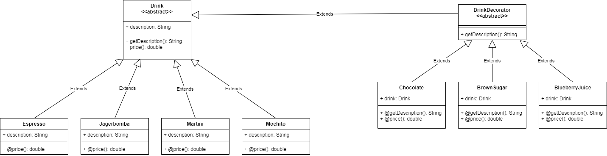

## Design pattern: Decorator
Decorator pattern is a design pattern that allows
behavior to be added to an individual object,
dynamically, without affecting the behavior of
other objects from the same class.

## Table of contents
* [General info](#general-info)
* [Technologies](#technologies)
* [Setup](#setup)

## General info
This project is inspired by:
Chapter 3 from:
Eric Freeman, Elisabeth Freeman, Bert Bates, Kathy Sierra
2017 Head First Design Patterns


## Technologies
Project is created with:
* Gradle
* JAVA 15.0.1.

## Setup
To run this project, install it locally using:

```
$ 
$ FORK from git
$ 
```
